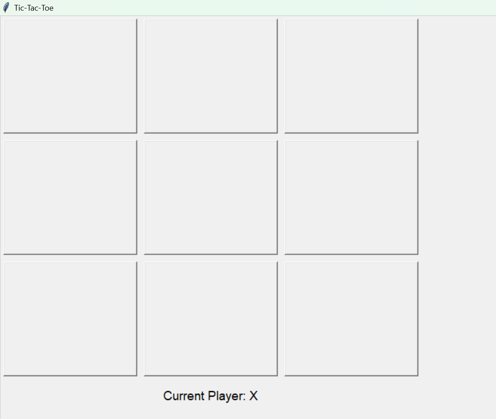
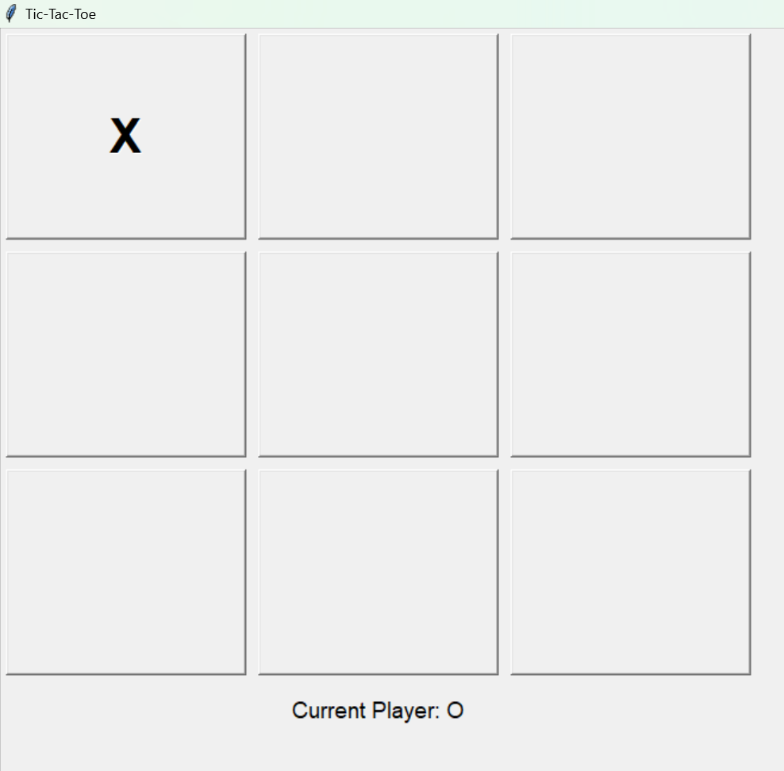
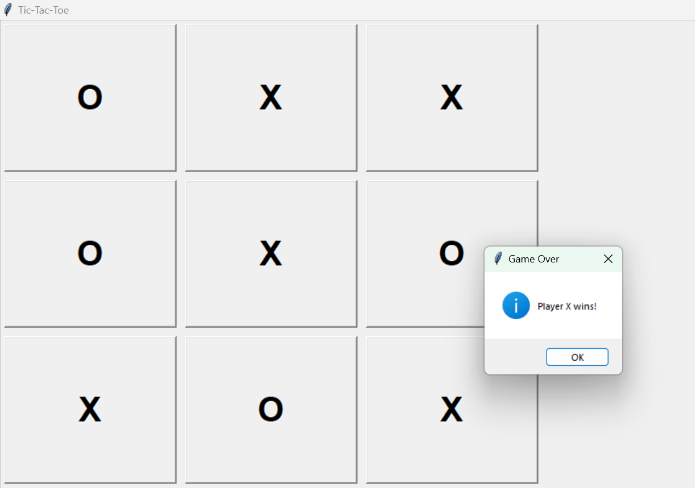

# Tic-Tac-Toe Game


## Overview

The **Tic-Tac-Toe Game** is a Python application that allows two players to play the classic Tic-Tac-Toe game on a graphical interface built with Tkinter.

## Features

- **Interactive UI**: Play Tic-Tac-Toe with a user-friendly graphical interface.
- **Player Indicator**: Shows the current player's turn.
- **Game Outcome**: Displays game outcomes such as wins and ties.
- **Win Highlight**: Highlights the winning combination on the board.

## Screenshots

### Player X's Turn


### Player O's Turn


### Game Result


## How to Use

1. **Clone the repository:**

    ```sh
    git clone https://github.com/inayatrahimdev/tic-tac-toe.git
    cd tic-tac-toe
    ```

2. **Run the game:**

    ```sh
    python tictactoe.py
    ```

3. **Play the game:**

    - Click on any empty cell to make your move.
    - The game will indicate whose turn it is and update the board accordingly.
    - The game will end when a player wins or when the board is full (tie game).

## Code Overview

### Main Functionality

The game is structured using object-oriented programming in Python, leveraging Tkinter for the GUI components.

```python
import tkinter as tk
from tkinter import messagebox

class TicTacToeGUI:
    def __init__(self, root):
        self.root = root
        self.root.title("Tic-Tac-Toe")

        # Initialize game variables
        self.board = [[' ' for _ in range(3)] for _ in range(3)]
        self.current_player = 'X'
        self.game_over = False

        # Create game UI
        self.create_board_ui()

    def create_board_ui(self):
        self.buttons = [[None for _ in range(3)] for _ in range(3)]
        
        # Create and place buttons for the board
        for row in range(3):
            for col in range(3):
                button = tk.Button(self.root, text='', font=('Arial', 30, 'bold'), width=8, height=3,
                                   command=lambda r=row, c=col: self.on_button_click(r, c))
                button.grid(row=row, column=col, padx=5, pady=5)
                self.buttons[row][col] = button
        
        # Display current player indicator
        self.player_label = tk.Label(self.root, text=f"Current Player: {self.current_player}", font=('Arial', 14))
        self.player_label.grid(row=3, column=0, columnspan=3, pady=10)

    def on_button_click(self, row, col):
        if not self.game_over and self.board[row][col] == ' ':
            # Update board state
            self.board[row][col] = self.current_player
            self.buttons[row][col].config(text=self.current_player, state='disabled', disabledforeground='black')
            
            # Check for winner
            winner = self.check_winner()
            if winner:
                self.game_over = True
                messagebox.showinfo("Game Over", f"Player {winner} wins!")
                self.highlight_winner(winner)
            elif self.is_board_full():
                self.game_over = True
                messagebox.showinfo("Game Over", "It's a tie!")

            # Switch player
            self.current_player = 'O' if self.current_player == 'X' else 'X'
            self.player_label.config(text=f"Current Player: {self.current_player}")

    def check_winner(self):
        # Check rows, columns, and diagonals for a winner
        for i in range(3):
            if self.board[i][0] == self.board[i][1] == self.board[i][2] != ' ':
                return self.board[i][0]  # Row win
            if self.board[0][i] == self.board[1][i] == self.board[2][i] != ' ':
                return self.board[0][i]  # Column win
        
        if self.board[0][0] == self.board[1][1] == self.board[2][2] != ' ':
            return self.board[0][0]  # Diagonal win
        if self.board[0][2] == self.board[1][1] == self.board[2][0] != ' ':
            return self.board[0][2]  # Diagonal win
        
        return None

    def is_board_full(self):
        # Check if the board is full (tie game)
        for row in self.board:
            if ' ' in row:
                return False
        return True

    def highlight_winner(self, winner):
        # Highlight winning combination on the board
        for i in range(3):
            # Row highlight
            if self.board[i][0] == self.board[i][1] == self.board[i][2] == winner:
                self.buttons[i][0].config(bg='green')
                self.buttons[i][1].config(bg='green')
                self.buttons[i][2].config(bg='green')
            # Column highlight
            if self.board[0][i] == self.board[1][i] == self.board[2][i] == winner:
                self.buttons[0][i].config(bg='green')
                self.buttons[1][i].config(bg='green')
                self.buttons[2][i].config(bg='green')
        
        # Diagonal highlights
        if self.board[0][0] == self.board[1][1] == self.board[2][2] == winner:
            self.buttons[0][0].config(bg='green')
            self.buttons[1][1].config(bg='green')
            self.buttons[2][2].config(bg='green')
        if self.board[0][2] == self.board[1][1] == self.board[2][0] == winner:
            self.buttons[0][2].config(bg='green')
            self.buttons[1][1].config(bg='green')
            self.buttons[2][0].config(bg='green')

if __name__ == "__main__":
    root = tk.Tk()
    game = TicTacToeGUI(root)
    root.mainloop()
============
#This is a simple Tic-Tac-Toe game implemented in Python using Tkinter for the GUI. Players can enjoy a classic game of Tic-Tac-Toe with an interactive interface.

## How to Play

- Player X starts the game.
- Click on an empty cell to make a move.
- The first player to align three of their symbols (horizontally, vertically, or diagonally) wins.
- If all cells are filled and no player has aligned three symbols, the game ends in a tie.
>>>>>>> f85381ef71afb69e5a6e4c2f584d9b8086433ecd
